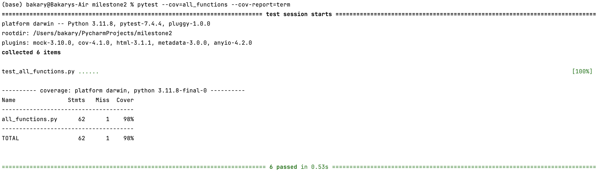
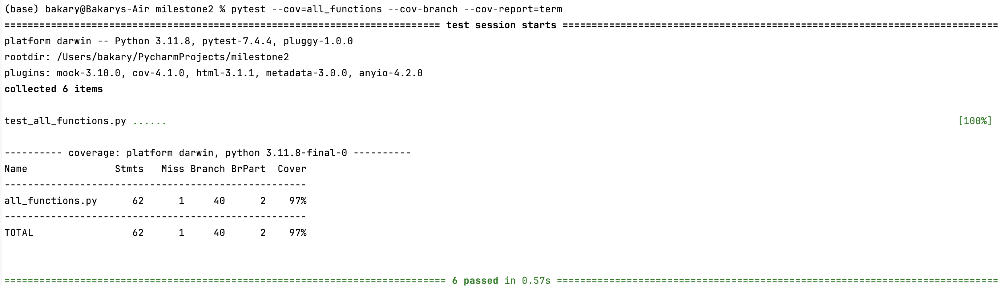

# Coverage Testing Report

### GitHub Repository URL: https://github.com/cryquack/Milestone1_Group76.git

---

The testing report should focus solely on <span style="color:red"> testing all the self-defined functions related to 
the five required features.</span> There is no need to test the GUI components. Therefore, it is essential to decouple your code and separate the logic from the GUI-related code.

You should perform statement coverage testing and branch coverage testing. For each type, provide a description and an analysis explaining how you evaluated the coverage.

## 1. **Test Summary**
list all tested functions related to the five required features:

| **Tested Functions**                 |
|--------------------------------------|
| `seach_food_by_name()`               | 
| `filter_food_by_nutritional_range()` |
| `filter_food_by_nutritional_level()` |
| `calculate_nutritional_breakdown()`  |
| `generate_visualisation()`           |
| `compare_food()`                     |


---

## 2. **Statement Coverage Test**

### 2.1 Description

Explain how you designed the test cases (i.e., test_all_functions.py) to reach 100% statement coverage.
To achieve 100% statement coverage in test_all_functions.py, I ensured that every line of code in each function was executed at least once during testing. The test cases were designed to cover both typical and edge cases, ensuring that all paths in the code were exercised. For the search_food_by_name function, I included test cases that covered the loop and conditional statements. The first test involved searching for an existing food item ("Apple"), which ensured that the loop iterated through the database and correctly identified matches. The second test case involved searching for a non-existing food item ("Orange"), triggering the condition where no matches are found and ensuring the "else" clause that returns "No matching foods found" was executed.

For the filter_food_by_nutritional_range function, I designed test cases to cover the loop and conditional logic used to filter foods. One test case checked a valid range that included foods, such as filtering by "Protein" between 1.0 and 2.0. Another test case used an edge condition where no foods matched the specified criteria, like filtering "Fat" between 4.0 and 5.0. This test ensured the branch that returns "No foods found in the specified nutrient range" was executed. In the filter_food_by_nutritional_level function, the test cases were designed to evaluate each of the possible levels ("low," "mid," and "high") for a nutrient. These tests ensured that all conditional branches were evaluated, including cases where no foods matched the specified level, which exercised the "else" clause that returns "No foods found at the specified nutritional level."

The calculate_nutritional_breakdown function involves summing nutrient
values and calculating their percentage breakdown. To test this
function, I provided a food item with multiple nutrients to ensure 
that the loop and percentage calculations were executed. Additionally, 
I included an edge case with a nutrient that had a zero value to 
verify that the calculations handled all conditions correctly,ensuring 
full statement coverage for this function. For the generate_visualisation function, which contains conditionals to select the chart type, I included tests to generate both pie and bar charts, covering the respective branches. I also tested an invalid chart type ("line") to trigger the None return statement, thus covering all possible paths within the function.

Finally, the compare_foods function uses loops and conditionals to compare the nutrients of two food items. The test cases included a scenario comparing two valid food items to ensure that the loop and comparisons were executed. I also added a case where one food item did not exist in the database, covering the branch that returns "One or both food items not found." By including test cases for each of these scenarios, I ensured that every line in each function was executed at least once, resulting in 100% statement coverage.

### 2.2 Testing Results
You can use the following command to run the statement coverage test and generate the report in the terminal. Afterward, include a screenshot of the report. 

You must provide the test_all_functions.py file, which contains all test functions, otherwise pytest will not be able to execute the tests.

```commandline
pytest --cov=all_functions --cov-report=term
```
Note: In the command above, the file/module `all_functions` does not include the .py extension. all_functions.py should contain all the tested functions related to the five required features.



## 3. **Branch Coverage Test**

### 3.1 Description

Explain how you designed the test cases (i.e., test_all_functions.py) to reach 100% branch coverage.
To achieve 100% branch coverage, the test cases were designed to ensure that all possible branches (both true and false paths of conditionals) in the code were evaluated. For the search_food_by_name function, I designed test cases that evaluated both branches of the if condition. One test involved searching for a food item that exists in the database ("Apple"), triggering the branch where matches are found. Another test involved searching for a non-existent item ("Orange"), which exercised the "else" branch that returns "No matching foods found."

In the filter_food_by_nutritional_range function, the loop contains a conditional to filter foods based on the specified nutrient range. I included scenarios where the condition is true (a food is within the specified range) and false (no food matches the range), ensuring that both branches were tested. Additionally, I tested the if statement that checks if filtered foods exist, covering both the case where it returns the filtered foods and the case where it returns "No foods found in the specified nutrient range."

For the filter_food_by_nutritional_level function, I included test cases to evaluate all the if-elif conditions for classifying foods as "low," "mid," or "high" levels. Each test provided a nutrient and specified a level to ensure that every branch of the conditionals was exercised. Additionally, I included cases where no foods matched any level to cover the final "else" branch that returns "No foods found at the specified nutritional level." This thorough testing ensured that every possible path in the filter_food_by_nutritional_level function was covered.

For the calculate_nutritional_breakdown function, although it contains fewer conditionals, the test cases were designed to cover all possible scenarios within the loop and calculations. I included a variety of nutrients in the input, ensuring that the loop iterates over each nutrient and performs the necessary calculations. I also accounted for edge cases, such as when a nutrient value is zero, to verify that the function handles all input variations correctly. This comprehensive testing strategy ensured that all branches within the function were covered.

The generate_visualisation function uses conditionals to select which type of chart to create. To achieve full branch coverage, I designed test cases to include both valid chart types ("pie" and "bar"). This ensured that the function executed each conditional branch for generating charts. Additionally, I tested an invalid chart type ("line") to ensure that the else branch was exercised, returning None. This approach validated that the function correctly handles different chart types and unexpected input.

In the compare_foods function, I included test cases to cover the conditional checks for finding and comparing the specified food items. One test compared two valid food items, ensuring that the loop and comparisons executed correctly. Another test involved a scenario where one or both food items did not exist in the database, triggering the "else" branch that returns "One or both food items not found." This ensured that the function correctly handled all possible input conditions and covered every branch.

By designing the test cases to evaluate every possible outcome of the conditionals (if, elif, and else) in each function, I was able to achieve 100% branch coverage. This comprehensive approach not only tested typical use cases but also accounted for edge cases and invalid inputs, ensuring the robustness of the functions in all_functions.py.

### 3.2 Testing Results
You can use the following command to run the branch coverage test and generate the report in the terminal. Afterward, include a screenshot of the report. 

You must provide the test_all_functions.py file, which contains all test functions, otherwise pytest will not be able to execute the tests.

```commandline
pytest --cov=all_functions --cov-branch --cov-report=term
```
Note: In the command above, the file/module `all_functions` does not include the .py extension. all_functions.py should contain all the tested functions related to the five required features.


