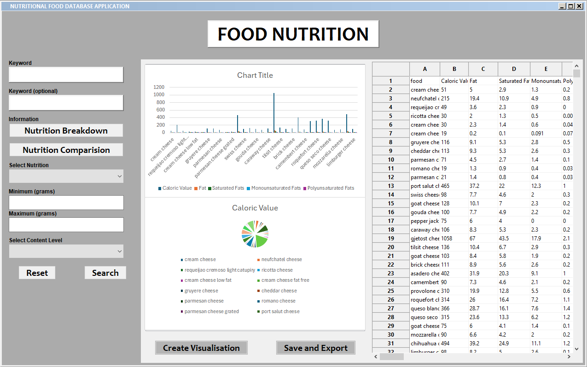

# Executive Summary

### GitHub Repository URL: https://github.com/cryquack/Milestone1_Group76.git

---

## 1. Food Search
### Description  
Enable users to search for foods by name and display all the nutritional information.

### Steps
1. System prompts for the food name.
2. Customer inputs the food name they require.
3. The system provides options from a list based on the spelling.
4. Customer must select the food item from the list based on the spelling.

### Screenshots

---

## 2. Nutrition Breakdown
### Description  
Enable users to select one food, and display pie charts & bar graphs showing the breakdown of different nutrients for the selected food.

### Steps
1. Customer must select "Nutrition Breakdown" from the food item searched.
2. System displays graphs and charts of the nutrients contained in the food.
3. Customers have the option to select the graphs and charts for more in-depth information e.g. measurements in grams and milligrams.

### Screenshots

---

## 3. Nutrition Range Filter
### Description  
Enable users to select one of nutrition and input minimum and maximum values, and the tool will display a list of foods that fall within those ranges.

### Steps
1. Customer must select a nutrition from the food item searched.
2. The system prompts the customer to input minimum and maximum values of the nutrition selected.
3. The system analyses the values.
4. The system displays a list to the customer with the food options within the value range.
5. Customer can select a food item and view the "Nutrition Breakdown"

### Screenshots 

---

## 4. Nutrition Level Filter
### Description  
Enable users to filter foods by nutritional content levels-low, mid, and high-including fat, protein, carbohydrates, sugar, sodium and nutritional density. The three levels are defined as follows: 
- Low: Less than 33% of the highest value.
- Mid: Between 33% and 66% of the highest value.
- High: Greater than 66% of the highest value.

### Steps
1. The system prompts the customer to select a nutritional content level-low, mid, and high.
2. The customer selects a nutritional content level from a list.
3. The system verifies the selection and breaks down the dataset that match.
4. The system loads in a list of foods with the same nutritional content level.

### Screenshots   

---

## 5. Nutrition Comparison
### Description  
Enable users to compare the nutrients contained in the food items by selecting "nutrition comparison" and inputting the second food item to display the list of nutrients side-by-side, which is shown in a line graph.

### Steps
1. The system prompts the customer to input another food item to compare the nutrients contained.
2. The customer must input and select the food item to compare the nutrients.
3. The system analyses the two food items selected from the dataset.
4. The system displays a line graph that compares the nutrients contained in the two food items.

### Screenshots    

---
