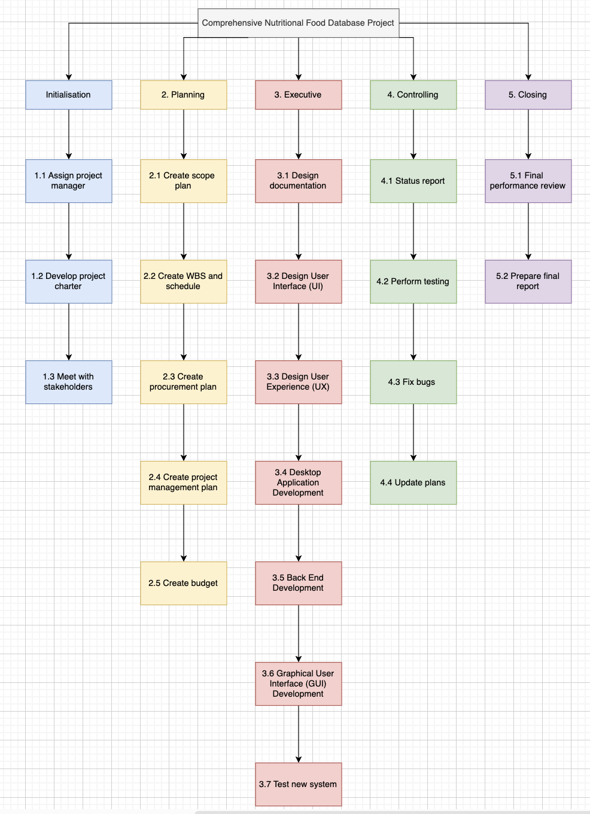

# Project Plan

## Project Name: Comprehensive Nutritional Food Database Project
## Group Number: 76

### Team members

| Student No. | Full Name       | GitHub Username | Contribution (sum to 100%) | 
|-------------|-----------------|-----------------|----------------------------|
| s5399572     | Crystal Quach  | cryquack        | 33.3% or Equal             |
| s5339515    | Bakary Fall     | bakaryfall      | 33.3% or Equal             | 
| s5260546     | Eric Lushchayev | ericjl333             | 33.3% or Equal             | 

### Brief Description of Contribution

Please Describe what you have accomplished in this group project.
- s5399572, Crystal Quach
  - Accomplishments: Describe what you have completed or achieved
- s5339515, Bakary Fall
  - Accomplishments: Describe what you have completed or achieved
- s333333, Eric Lushchayev
  - Accomplishments: Describe what you have completed or achieved

# Table of Contents

* [Project Plan](#project-plan)
  * [1. Project Overview](#1-project-overview)
    * [1.1 Project Objectives](#11-project-objectives)
    * [1.2 Project Stakeholders](#12-project-stakeholders)
    * [1.3 Project Scope](#13-project-scope)
  * [2. Work Breakdown Structure](#2-work-breakdown-structure)
  * [3. Activity Definition Estimation](#3-activity-definition-estimation)
  * [4. Gantt Chart](#4-gantt-chart)

## 1. Project Overview

### 1.1 Project Objectives

The objective of this project is to develop a desktop application that serves as a simple data analysis and visualisation tool. The project will be divided into two main phases which are the design phase and implementation. 
In the first phase, the focus will be on designing the tool including the layout, user interface, and the overall architecture. The design phase is crucial as it sets the foundation for the application, ensuring it is user-friendly and meets all specified requirements.

### 1.2 Project Stakeholders

The project success hinges on the active involvement of several key stakeholders, each playing a distinct role in ensuring the project meets its objectives and delivers a high-quality product. For this project here are the stakeholders needed:
* **Project manager**: The project manager oversee the entire project, ensuring it stays on schedule, within budget, and meets all objectives/requirements. The project manager coordinate the effort of the team, manage resources, and act as the main point of contact between the project team and other stakeholders. The project manager is also responsible for keeping the project aligned with its goals and ensuring the milestones are achieved on time.
  
* **Developers**: Developers are responsible for the implementation of the software. They will write the code, integrate, and ensure that the application functions according to the design specifications. Developers work closely with designers to bring the project from concept to reality, addressing any technical challenges that arise.
  
* **Designers**: Designers focus on creating the interface and user experience of the application. They create layouts, wireframes, and prototypes to guide the development process and ensure that the end product meets user needs and expectations.
  
* **Front and End Users**: The Front users are mainly internal stakeholders (team members/testers) who interact with the software during the development phase. Their role is to provide feedback on the functionality and usability of the application, and identify any issues that needs improvement before the release. On the other hand, End users are the people who will use the final application. Their needs are central to the design and functionality of the website/application. The project team aims to meets the end users' requirement, and their feedback is needed during the testing phase to ensure the website/application is practical and user-friendly.

* **Investors**: Investors are external stakeholders who provide a company's capital to grow and expand its operations. Their primary interest is seeing their investment's value increase over time. They can monitor the project's progress and may offer input to ensure that the project's progress aligns with their expectations and financial goals.

### 1.3 Project Scope

The project scope focuses on planning and designing the desktop application. The team will start by analysing the dataset to determine the application's requirements. We will then design the user interface, create layouts and prototypes to ensure the tool is user-friendly and meets project goals. Alongside UI design, we will plan the software's structure, and decide how different parts will connect and function.

## 2. Work Breakdown Structure

The Work Breakdown Structure (WBS) for the Comprehensive Nutritional Food Database Project outlines the project's phases and associated tasks in a structured format to facilitate efficient project management. The project is divided into five main phases: Initialisation, Planning, Execution, Controlling and Closing. During Initialisation, key activities include assigning the project manager, developing the project charter, and meeting with stakeholders to ensure all foundational elements are in place. The Planning phase focuses on creating the scope plan, WBS, schedule, procurement plan, project management plan, and budget, setting the stage for a well-organised execution. The Execution phase involves detailed tasks like designing documentation, user interface (UI), and user experience (UX), followed by desktop application, backend, and graphical user interface (GUI) development, culminating in system testing. Controlling includes status reporting, performance testing, bug fixing, and updating plans to keep the project on track. Finally, the Closing phase wraps up with a final performance review and the preparation of a comprehensive final report. This structured approach ensures that all project aspects are systematically addressed to achieve the project objectives within the planned timeline.

## 3. Activity Definition Estimation

Define the activities required for your project based on the WBS, and assign responsibilities to team members. Each activity should be numbered and correspond with your Gantt chart. Provide estimated durations for each activity to facilitate Gantt chart preparation.

| Activity #No | Activity Name                              | Brief Description                                                                                              | Duration | Responsible Team Members    |
|--------------|--------------------------------------------|----------------------------------------------------------------------------------------------------------------|----------|-----------------------------|
| 1.1          | Assign Project Manager                     | Identify and appoint a project manger to oversee the project's execution.                                      | 1 day    | xxx \& yyy                  |
| 1.2          | Develop project charter                    | Create a project charter to outline the project's objectives, scope, stakeholders, and timeline.               | 2 days   | Project Manager             |
| 1.3          | Meet with stakeholders                     | Conduct meetings with stakeholders to understand their needs and expectations for the project.                 | 2 days   | Project Manager             |
| 2.1          | Create scope plan                          | Define the project scope.                                                                                      | 2 days   | Project Manager             |
| 2.2          | Create WBS and Schedule                    | Develop a Work Breakdown Structure and schedule to organise project tasks and timeline.                        | 1 day    | Project Manager             |
| 2.3          | Create procurement plan                    | Plan for the acquisition of necessary software, hardware, and other resources.                                 | 1 day    | All                         |
| 2.4          | Create project management plan             | Develop a comprehensive project management plan covering communication, risk, quality, and resource management. | 2 days   | Project Manager             |
| 2.5          | Create Budget                              | Estimate the project costs and prepare a budget to manage financial resources effectively.                     | 1 day    | Project Manager             |
| 3.1          | Design Documentation                       | Develop detailed design documents that outline the system, features, and technical requirements                | 3 days   | Designers                   |
| 3.2          | Design User Interface (UI)                 | Create wireframes and UI mockups to visualise the layout and user interactions of the application.             | 4 days   | Designers                   |
| 3.3          | Design User Experience (UX)                | Design the UX, ensuring that the application is intuitive, accessible, and user-friendly.                      | 3 days   | Designers                   |
| 3.4          | Desktop application Development            | Develop the desktop application software, implementing core functionalities according to design specifications. | 5 days   | Developers                  |
| 3.5          | Back End Development                       | Build and configure backend systems, including databases and server-side logic, to support functionalities.    | 4 days   | Developers                  |
| 3.6          | Graphical User Interface (GUI) Development | Develop and integrate graphical user interface, ensuring that the visual components are fully functional.      | 4 days   | Developers                  |
| 3.7          | Test New System                            | Conduct comprehensive testing of the new system.                                                               | 5 days   | Front Users                 |
| 4.1          | Status Reports                             | Regularly prepare and distribute status reports to stakeholders, providing updates on the project project.     | 2 days   | Project Manager             |
| 4.2          | Perform Testing                            | Monitoring ongoing testing activities to ensure that the system meets project requirements.                    | 3 days   | End Users                   |
| 4.3          | Fix Bugs                                   | Fix bugs or defects discovered during the testing phase.                                                       | 3 days   | Developers                  |
| 4.4          | Update Plans                               | Update project plans to reflect changes and adjustments based on the testing outcomes.                         | 2 days   | Project Manager             |
| 5.1          | Final Performance Review                   | Conduct a final performance review to evaluate project objectives have been met.                               | 1 day    | Project Manager & Investors |
| 5.2          | Prepare Final Report                       | Compile a final report.                                                                                        | 1 day    | Project Manager             |

## 4. Gantt Chart
You have to use the provided Gantt chart template.  

Use the provided Gantt chart template to list all items from the Activity Definition along with relevant estimates 
and scheduling. Ensure that the Gantt chart reflects the activity definitions from Section 3. Track actual start 
times and durations. Besides including Gantt chart here, you should also submit your Gantt chart file separately.

