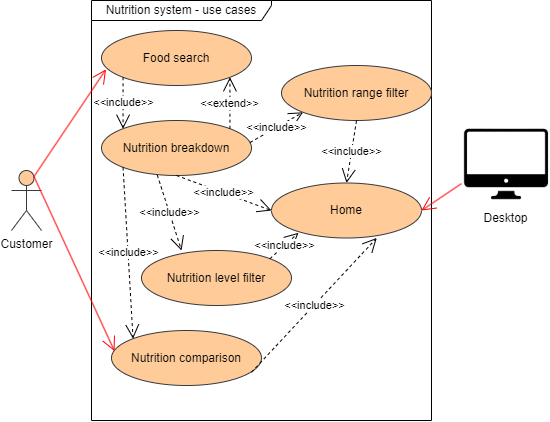

# Software Design Document

## Project Name: Comprehensive Nutritional Food Database Project
## Group Number: 76

## Team members

| Student Number | Name      | 
|----------------|-----------|
| s5399572        | Crystal Quach |
| s5339515        | Bakary Fall | 
| s5260546        | Eric Lushchayev | 

# Table of Contents

<!-- TOC -->
* [Table of Contents](#table-of-contents)
  * [1. System Vision](#1-system-vision)
    * [1.1 Problem Background](#11-problem-background)
    * [1.2 System capabilities/overview](#12-system-capabilitiesoverview)
    * [1.3	Potential Benefits](#13potential-benefits)
  * [2. Requirements](#2-requirements)
    * [2.1 User Requirements](#21-user-requirements)
    * [2.2	Software Requirements](#22software-requirements)
    * [2.3 Use Case Diagram](#23-use-case-diagram)
    * [2.4 Use Cases](#24-use-cases)
  * [3. Software Design and System Components](#3software-design-and-system-components)
    * [3.1 Software Design](#31software-design)
    * [3.2 System Components](#32system-components)
      * [3.2.1 Functions](#321-functions)
      * [3.2.2 Data Structures / Data Sources](#322-data-structures--data-sources)
      * [3.2.3 Detailed Design](#323-detailed-design)
  * [4. User Interface Design](#4-user-interface-design)
    * [4.1 Structural Design](#41-structural-design)
    * [4.2	Visual Design](#42visual-design)
<!-- TOC -->

## 1. System Vision

### 1.1 Problem Background

_Problem Identification:_  
The difficulty in obtaining the detailed nutritional information for a wide range of foods that is commonly consumed around the world.

_Dataset:_  
Nutritional Food Database which contains the needed nutritional information for each food item measured in grams(g) or milligrams(mg) e.g. carbohydrates(in g), sodium(in g), and iron(in mg).

_Data Input/Output:_  
In order for customers to acquire detailed nutritional information, they must provide the food item by inputting it into the system. The system will output all the detailed nutritional content that customers require e.g. pie charts and bar graphs displaying every single nutrients contained in the food searched.

_Target Users:_  - The hospitality industry will use this system to source and display the nutritional content in the foods they provide to consumers. - Dietitians and nutritionists will utilise this system in order to prepare dietary and nutritional advice to consumers seeking diet-related goals. - Everyday users who may have specific dietary restrictions or requirements such as diabetes or food allergies may want to use this system to acquire their needed source of nutrients.

### 1.2 System capabilities/overview

_System Functionality:_  
This system will provide a wide range dataset of various nutritional content in-depth, supporting dietry, health, medical and research implementations. Some of these are hard to obtain as the food item may come from different places around the world.

_Features and Functionalities:_
- Food search: Users search for foods by name. This will provide them with the nutritional information;
- Nutrition breakdown: Displays pie charts and bar graphs showing the breakdown of different nutrients contained in the food searched
- Nutrition range filter: Enable users to select one of nutrition and input minimum and maximum values, and the tool will display a list of foods that fall within those ranges
- Nutrition level filter: Enable users to filter foods by nutritional content levels-low, mid, and high-including fat, protein, carbohydrates, sugar, sodium and nutritional density. The three levels are defined as follows:
 - Low: Less than 33% of the highest value.
 - Mid: Between 33% and 66% of the highest value.
 - High: Greater than 66% of the highest value.
- Nutrition comparison: Enable users to compare food items by selecting "compare" and inputting the second food item to display the list of nutrients side-by-side shown in a line graph.

### 1.3	Potential Benefits

This application system will provide significant value to nutritionists and dietitians who can implement this to their structure. This will assist the consumers that are seeking professional help with their diets and healthy eating by obtaining the nutritional content. Everyday users may also perceive this system of great value as they need the nutritional content for their daily lives, i.e. people who have food allergies or diabetes.  
A benefit of using this application system is the efficiency. Searching up a food item on a search engine will only provide users the nutrients contained in the food and their measurements, whereas this system will provide the same information but more in-depth with the use of statistics e.g. nutrition breakdown displayed in charts and graphs. The system also has the option to go further more in detail by filtering the range and level of nutrients they wish to obtain which will show in a list to choose from. Another benefit is the simple layout and design of the system which everybody can use with no difficulty.

## 2. Requirements

### 2.1 User Requirements
list of user needs in a nutritional data based software system:
- Users are expected to download the application system onto their desktops in order to access the nutritional information.
- Users must be able to correctly spell the food item they wish to obtain nutritional content from.
- Users may be prompt to select from a list, which may contain food items or nutrition levels.
- Users may be prompt to input values to view further nutritional information.
- Users are expected to select from a set of options to view further nutritional information.
- Users are able to change the food item inputted by selecting "Home".
- Users are expected to update the software every half-year to fix bugs and update the system.

### 2.2	Software Requirements
list of all necessary software functionalities in a nutritional data based software system:
- The software shall provide users easy access to the nutritional content.
- The application system shall have a simple and visually appealing layout to attract new users.
- The software shall only provide nutritional information once a food item is searched.
- Each food item shall display nutritional content with precise measurements per 100 grams in a graph or chart.
- The software shall filter thorugh the dataset to provide users a list to match the nutrition range selected.
- The software shall filter thorugh the dataset to provide users a food list with the same nutritional content level selected.
- The software shall be able to compare the nutrients contained in two food items with a line graph.
- The software shall be able to access the "Home" page from all parts of the system to input a different food item.
- The software system shall have updates and bug fixes every half-year.

### 2.3 Use Case Diagram
 

### 2.4 Use Cases

| Use Case ID      | UC-01 |
|------------------|------|
| Use Case Name    | Food Search |
| Actors           | Customer |
| Description      | Enable users to search for foods by name and display all the nutritional information. |
| Preconditions    | The desktop application must be downloaded and up-to-date. |
| Flow of Events   | 1. System prompts for the food name.   2. Customer inputs the food name they require.   3. The system provides options from a list based on the spelling.   4. Customer must select the food item from the list to continue. |
| Alternate Flow   | If the food does not appear on the list, the system will prompt the user to try again after checking the correct spelling of the food item. |

| Use Case ID      | UC-02 |
|------------------|------|
| Use Case Name    | Nutrition breakdown |
| Actors           | Customer |
| Description      | Enable users to select one food, and display pie charts & bar graphs showing the breakdown of different nutrients for the selected food. |
| Preconditions    | The customer must input a food item. |
| Flow of Events   | 1. Customer must select "Nutrition breakdown" from the food item searched.   2. System displays graphs and charts of the nutrients contained in the food.   3. Customers have the option to select the graphs and charts for more in-depth information e.g. measurements in grams and milligrams. |
| Postconditions   | The nutritional content is shown and the customer has the option to exit "home" to search a different food item. |

| Use Case ID      | UC-03 |
|------------------|------|
| Use Case Name    | Nutrition range filter |
| Actors           | Customer |
| Description      | Enable users to select one of nutrition and input minimum and maximum values, and the tool will display a list of foods that fall within those ranges. |
| Preconditions    | The customer must input a food item. |
| Trigger          | The customer selects the "Nutrition range filter" option. |
| Flow of Events   | 1. Customer must select a nutrition from the food item searched.   2. The system prompts the customer to input minimum and maximum values of the nutrition selected.   3. The system analyses the values.   4. The system displays a list to the customer with food options within the value range. |
| Alternate Flow   | If there is no food item within the value range, the system will prompt the customer to input a different value range. |
| Postconditions   | The list of foods within the nutrition range is displayed and the customer has the option to exit "home" to search a different food item. |

| Use Case ID      | UC-04 |
|------------------|------|
| Use Case Name    | Nutrition level filter |
| Actors           | Customer |
| Description      | Enable users to filter foods by nutritional content levels-low, mid, and high-including fat, protein, carbohydrates, sugar, sodium and nutritional density. |
| Preconditions    | The customer must input a food item. |
| Trigger          | The customer selects the "Nutrition level filter" option. |
| Flow of Events   | 1. The system prompts the customer to select a nutritional content level-low, mid, and high.   2. The customer selects a nutritional content level from a list.   3. The system verifies the selection and breaks down the dataset that match.   4. The system loads in a list of foods with the same nutritional content level. |
| Postconditions   | The list of foods filtered by the nutritional content levels is shown from the customer selection. The customer has the option to exit "home" to search a different food item. |

| Use Case ID      | UC-05 |
|------------------|------|
| Use Case Name    | Nutrition comparison |
| Actors           | Customer |
| Description      | Enable users to compare the nutrients contained in the food items by selecting "Nutrition comparison" and inputting the second food item to display the list of nutrients side-by-side shown in a line graph. |
| Preconditions    | The customer must input a food item. |
| Trigger          | The customer selects the "Nutrition comparison" option. |
| Flow of Events   | 1. The system prompts the customer to input another food item to compare the nutrients contained.   2. The customer must input and select the food item to compare the nutrients.   3. The system analyses the two food items selected from the dataset.   4. The system displays a line graph that compares the nutrients contained in the two food items. |
| Postconditions   | The nutritional content comparison between two food items is shown through a line graph and the customer has the option to exit "home" to search a different food item. |

| Use Case ID      | UC-06 |
|------------------|------|
| Use Case Name    | Home |
| Actors           | Customer |
| Description      | Enable users to return home to input a different food item. |
| Preconditions    | The customer must input a food item. |
| Trigger          | After a long period of inactivity or the customer selects the "Home" option. |
| Flow of Events   | 1. The customer selects "Home".   2. The system ends the session and resets back to "Home", prompting the customer to enter a food name.                              |
| Postconditions   | The system returns the customer "Home", and the application is ready to be used again. |

## 3.	Software Design and System Components

### 3.1	Software Design
Include a flowchart that illustrates how your software will operate.

Example:  

### 3.2	System Components

#### 3.2.1 Functions
List all key functions within the software. For each function, provide:
- Description: Brief explanation of the function’s purpose.
- Input Parameters: List parameters, their data types, and their use.
- Return Value: Describe what the function returns.
- Side Effects: Note any side effects, such as changes to global variables or data passed by reference.

3.2 System Components

3.2.1 Functions

Function 1: search_food_by_name

Description: This function allows users to search for food items by name. It queries the database and returns a list of foods that match up with the input word.

Input Parameters: food_name (String): The name of the food item the user is searching for.

Return Value: List of dictionaries: Each dictionary contains the details and nutritional information of a food item that matches up with the search term.

Side Effects: None.

Function 2: filter_food_by_nutritional_range

Description: This function filters foods based on a specified nutritional range. Users can input a nutrient (for example: protein, fat) and a minimum and maximum value to get a list of foods that go in that range.

Input Parameters: nutrient (String): The specific nutrient to filter by (such as "protein", "fat").
min_value (Float): The minimum acceptable value for the nutrient.
max_value (Float): The maximum acceptable value for the nutrient.

Return Value: List of dictionaries: Each dictionary contains the details and nutritional information of foods that match the specified nutrient range.

Side Effects: None.

Function 3: filter_food_by_nutritional_level

Description: This function filters foods by nutritional level—low, mid, or high—for a specific nutrient. The levels are determined relative to the highest value of that nutrient in the database.

Input Parameters:
nutrient (String): The nutrient to filter by (such as "carbohydrates", "sodium").
level (String): The desired level for the nutrient ("low", "mid", or "high").

Return Value: List of dictionaries: Each dictionary contains the details and nutritional information of foods that match the specified nutritional level.

Side Effects: None. 

Function 4: calculate_nutritional_breakdown

Description: This function calculates the percentage breakdown of different nutrients in a given food item. It provides a detailed analysis of the food’s nutritional composition.

Input Parameters:
food_item (Dictionary): A dictionary containing the nutritional values of a food item.

Return Value: Dictionary: A dictionary containing the percentage breakdown of each nutrient within the food item.

Side Effects: None.

Function 5: generate_visualisation

Description:
This function generates visual representations of the nutritional data, such as pie charts or bar graphs, to help users better understand the nutritional breakdown of a food item.
Input Parameters:

nutritional_data (Dictionary): A dictionary containing the nutritional breakdown of a food item.
chart_type (String): The type of chart to generate, either "pie" or "bar".

Return Value:
Visualisation object: An object representing the generated chart, which can be displayed or saved as an image file.

Side Effects: None. 

Function 6: compare_foods

Description: Compares the nutritional information of multiple food items and provides a detailed comparison report, highlighting and displaying similarities and differences in nutritional content between different foods.

Input Parameters:
food_items (List of Dictionaries): A list where each dictionary contains the nutritional information of a food item to be compared.

comparison_metric (String): The specific nutrient or nutrients to compare (e.g., "protein", "fat", "carbohydrates").

Return Value: Dictionary: A dictionary where each key is a food item name and the value is another dictionary containing the comparison results. The comparison results may include the average, highest and lowest values for the specified nutrients.

Side Effects: None.

#### 3.2.2 Data Structures / Data Sources
List all data structures or sources used in the software. For each, provide:

- Type: Type of data structure (e.g., list, set, dictionary).
- Usage: Describe where and how it is used.
- Functions: List functions that utilize this structure.

3.2.2 Data Structures / Data Sources

1. List of Dictionaries

Type: List of Dictionaries

Usage:
This is the primary data structure used to store the nutritional information for various food items. Each food item is represented as a dictionary where the keys are nutrient names ("caloric_value", "fat", "protein") and the values are the related number data for each nutrient.
]

Functions:
search_food_by_name()
filter_food_by_nutritional_range()
filter_food_by_nutritional_level()
calculate_nutritional_breakdown()
compare_foods()

2. Set

Type: Set

Usage:Used to store unique nutrient names or food categories. This allows for quick lookups and ensures that no duplicates are present.

Functions:
get_unique_nutrients()
filter_food_by_category()

3. Dictionary

Type: Dictionary

Usage:
Represents individual food items with their associated nutritional values. Each dictionary contains the name of the food item and its nutritional data.

Functions:
calculate_nutritional_breakdown()
display_food_nutrition()

4. Graph / Chart Data Structure

Type: Graph / Chart Data Structure

Usage:
Used for making visual representation of nutritional breakdowns by using pie charts and bar charts. Nutritional data from the dictionaries is mapped onto these visual representations.

Functions:
generate_nutritional_pie_chart()
generate_nutritional_bar_chart()

5. External Data Source (Nutritional Dataset)

Type: External Data Source

Usage:
The core nutritional data is sourced from an external dataset, which may be in the form of a CSV file, API, or database containing detailed nutritional information for a variety of foods.

Functions:
load_data_from_csv()
update_nutritional_database()

#### 3.2.3 Detailed Design
Provide pseudocode or flowcharts for all functions listed in Section 3.2.1 that operate on data structures. For instance, include pseudocode or a flowchart for a custom searching function.

3.2.3 Detailed Design

Function 1: search_food_by_name

Pseudocode:

Function search_food_by_name(food_name):
    Initialise an empty list named matched_foods
    For each food in the food_database:
        If food.name contains food_name:
            Add food to matched_foods
    If matched_foods is not empty:
        Return matched_foods
    Else:
        Return "No matching foods found"

This function searches the food database for items matching the provided food name and returns a list of matched items or a message if no matches are found.

Function 2: filter_food_by_nutritional_range
Pseudocode:

plaintext
Copy code
Function filter_food_by_nutritional_range(nutrient, min_value, max_value):
    Initialise an empty list named filtered_foods
    For each food in the food_database:
        If min_value <= food[nutrient] <= max_value:
            Add food to filtered_foods
    If filtered_foods is not empty:
        Return filtered_foods
    Else:
        Return "No foods found in the specified nutrient range"
Explanation:

This function filters foods based on a specified range for a particular nutrient and returns a list of foods that are within that range.

Function 3: filter_food_by_nutritional_level

Pseudocode:

Function filter_food_by_nutritional_level(nutrient, level):
    // Determine the highest value of the specified nutrient in the food_database
    highest_value = find_highest_value(nutrient)
    
    // Define thresholds for low, mid, and high levels
    low_threshold = 0.33 * highest_value
    mid_threshold = 0.66 * highest_value
    
    // Initialize an empty list named level_filtered_foods
    level_filtered_foods = []
    
    // Iterate through each food item in the food_database
    For each food in food_database:
        // Check if the nutrient value of the food falls within the defined boundaries for level
        If level == "low" and food[nutrient] < low_threshold:
            Add food to level_filtered_foods
        Else If level == "mid" and low_threshold <= food[nutrient] < mid_threshold:
            Add food to level_filtered_foods
        Else If level == "high" and food[nutrient] >= mid_threshold:
            Add food to level_filtered_foods
    
    // Return the filtered list or a message if no foods match the criteria
    If level_filtered_foods is not empty:
        Return level_filtered_foods
    Else:
        Return "No foods found at the specified nutritional level"

Explanation:
This function filters foods based on nutritional levels relative to the highest value in the database for the specified nutrient.

Function 4: calculate_nutritional_breakdown

Pseudocode:
Function calculate_nutritional_breakdown(food_item):
    Initialise a total variable to 0
    For each nutrient in food_item:
        Add food_item[nutrient] to total
    Initialise an empty dictionary named breakdown
    For each nutrient in food_item:
        Calculate the percentage of each nutrient relative to total
        Add the percentage to breakdown
    Return breakdown

Explanation:
This function will calculate the percentage breakdown of nutrients in a food item and returns a dictionary with the percentages.

Function 5: generate_visualisation

Pseudocode:

 Function generate_visualisation(nutritional_data, chart_type):
    If chart_type is "pie":
        Generate a pie chart using nutritional_data
    Else If chart_type is "bar":
        Generate a bar chart using nutritional_data
    Return the visualisation object

Explanation:
This function generates visual representations of the nutritional data (pie or bar chart) based on the specified chart type (either bar or pie).

Function 6: compare_foods

Pseudocode:
Function compare_foods(food1_name, food2_name):
    Initialise an empty dictionary named comparison_result
    Retrieve food1 from the food_database using food1_name
    Retrieve food2 from the food_database using food2_name
    If both foods are found:
        For each nutrient in food1 and food2:
            Compare nutrient values of food1 and food2
            Add comparison results to comparison_result
        Return comparison_result
    Else:
        Return "One or both food items not found"

Explanation:

This function compares two food items by their nutrient values and returns a dictionary with the comparison results.

## 4. User Interface Design

### 4.1 Structural Design
Present a structural design, a hierarchy chart, showing the overall interface’s structure. Address:

- Structure: How will the software be structured?
- Information Grouping: How will information be organized?
- Navigation: How will users navigate through the software?
- Design Choices: Explain why these design choices were made.

Example:  

The software will be structured in a modular manner, with different components handling different specific functionalities. This structure will allow for easier maintenance, updates, and scalability. 

The modules of the system are:

User Interface (UI)
Search Module
Filter Module
Visualisation Module
Comparison Module

Core Logic
Search Functions
Filter Functions
Visualisation Functions
Comparison Functions

Data Management
Database Interface
Data Loading and Parsing

Utilities
Helper Functions
Data Transformation

Information Grouping:

Food Data: Nutritional information for different food items.
User Input: Search queries, filter parameters, and comparison criteria.
Results: Search results, filtered lists, visual representations, and comparison reports.

The information will be organised in a way that each module has a clear responsibility:
Search Module: Handles searching for food items based on user queries.
Filter Module: Applies nutritional filters to display relevant food items.
Visualisation Module: Generates charts and graphs for nutritional data.
Comparison Module: Compares the nutritional content of multiple food items.

Navigation

The user can use:

Main Menu: Provides access to different modules (Search, Filter, Visualisation, Comparison).
Submenus: Allow users to select specific functions within each module (such as specifying nutrient types or levels).
Search Bar: For entering food names.
Filter Options: For setting nutritional ranges and levels.
Visual Controls: For selecting chart types and viewing results.
Comparison Interface: For selecting and comparing multiple food items.

Design Choices

Modular Design: Dividing the software into modules improves maintainability and flexibility. Each module focuses on a specific aspect of the application, making it easier to manage and update individual components.

Hierarchical Navigation: The use of a main menu and submenus ensures a clear and intuitive navigation path for users. This structure helps users easily access different functionalities without a user feeling overwhelmed.

Separation of Concerns: By separating UI components from core logic and data management, the design ensures that changes in one area (user interface) do not affect other areas (such as data handling), leading to a more robust and manageable system.

User focused Design: The navigation and layout are designed to be user friendly, allowing users to efficiently search for foods, apply filters, view charts, and compare items. This approach benefits the overall user experience and makes sure that the software meets user needs effectively.

### 4.2	Visual Design
Include all wireframes or mock-ups of the interface. Provide a discussion, explanation, and justification for your design choices. Hand-drawn wireframes are acceptable.

- Interface Components: Clearly label all components.
- Screens/Menus: Provide wireframes for different screens, menus, and options.
- Design Details: Focus on the layout and size of components; color and graphics are not required. 

The layout is designed for clarity, easy navigation, and quick access to the most important features. It is designed in such a way that the key features are all accessible on the page, and can be accessed easily. When the user inputs the information they want, the ui will come up with the table/charts and information necessary.

